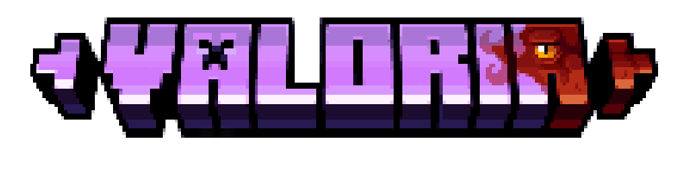
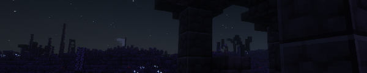
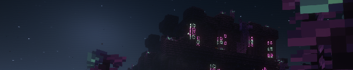
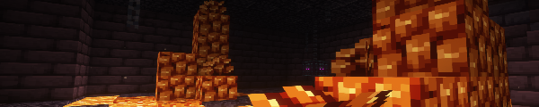
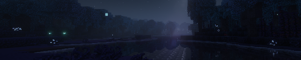
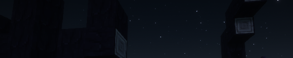
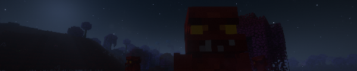
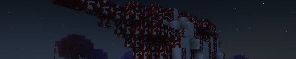

# Requirements

  
  
  
  

Join us to share your creations, provide feedback, and see sneak peeks of what's lurking in the shadows.

To help us dedicate more time to the project and fund new assets like music and sounds, consider becoming a Patron.

An ancient cataclysm, the Elemental Collapse, tore reality asunder. From the ashes, a new world was born—one of dark myth and terrifying ruin. Valoria transforms Minecraft into an epic RPG experience where you must learn what happened to the ancient world.

Journey through desolate landscapes haunted by monstrous creatures. Piece together the fractured history of a fallen world and discover if any hope can be rekindled from the embers.

## Features
 - ⚔️ Mobs, Bosses, huge weaponry, lots of building blocks and items — all with vanilla-styled textures
 - 🏰 Structures, biomes and whole new Dimension full of secrets and danger
 - 📖 Deep lore rooted in mythology and built for exploration
 - 🎵 Immersive Original Soundtrack written by [DuUaader](https://youtube.com/playlist?list=OLAK5uy_kTIzlCKrHm_RyFxoZPmnKZNccdCT6XL-c&si=0-No5jkq0tsd3neC)
 - ☠️ Dark-fantasy and post-apocalyptic styled

---

**Find various structures**
---
Valoria's landscape is scattered with unique, hand-crafted structures waiting to be discovered.
From the ruins to a large Structures to contain a specific entity, but beware of traps and guardians of those structures

**Explore the flora**
---
The Elemental Collapse did not destroy the world but twisted it. Journey through vibrant, alien biomes where nature is struggling to reclaim the ruins. You will find that life has adapted in strange and unnatural ways.
world that has adapted to darkness. The old flora has given way to strange new life forms that produce their own light. Explore bizarre biomes where luminescent flora is your only light of hope

**Scavenge across barrens**
---

These Barrens are the open graves of entire ecosystems, haunted by skeletal forests and choked with dust. Here, the ground itself has been eroded by a relentless, sorrowful wind, leaving a scarred and barren landscape

**Beware of different creatures**
---

The fauna of the old world was not spared by the Collapse. Corruption forced the world's fauna to adapt or perish, and the survivors are fiercely territorial hunters. They stalk the eternal twilight and you are prey 

**Investigate the World**
---

The sky itself is broken. A malevolent red planet now hangs in the eternal night, and its gaze is a poison upon the land. This celestial body fuels a creeping "bloodborne corruption," a plague that not only killed the old fauna but keeps growing upon the world. You will discover colossal remains called 'Monstrosities' these are the victims of a bloodborne corruption.

**Compatibilities**  
---
* JADE: built-in  
* JER: built-in  
* JEI: built-in  
* KubeJS: built-in  
* JEED: built-in  
* Enchantment Descriptions: built-in  
* Better Combat: built-in  
* JERM: Automatically generated  
* Tetra: built-in  
* Detailed Enchantments: built-in
* Catalogue: built-in
* Obscure Tooltips: built-in
* Every Compat: Since 1.0r
* Epic Fight: [Download - CurseForge](https://www.curseforge.com/minecraft/data-packs/valoria-ef-compat)

Feel free to suggest mod compats - [GitHub](https://github.com/IriDark/Valoria-Suggestions)

**Languages supported**
---
*  English  
*  Ukrainian (not 100% accurate, may contain mistakes | not fully translated)   - by IriDark, Foxplane
*  Polish (not fully translated)   - by  𝙆𝘼𝙈𝙀𝙃𝙇𝙇𝙄𝙉𝙆  
*  Russian - by Ruthenium, TerraPrime, Kerdo   
*  French (not fully translated) - by  𝙆𝘼𝙈𝙀𝙃𝙇𝙇𝙄𝙉𝙆

Not found your language or want to maintain translations? Feel free to translate and PR - [GitHub](https://github.com/IriDark/Valoria/blob/main/CONTRIBUTING.md)

